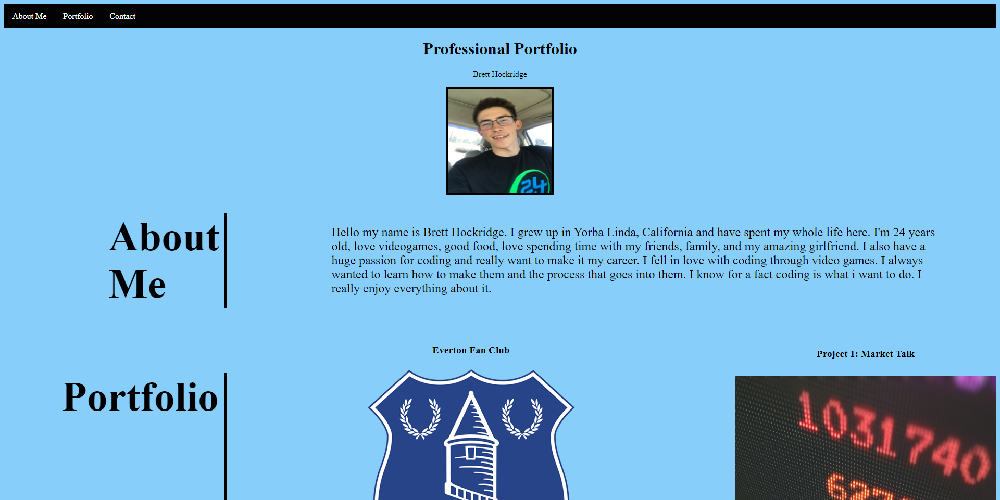
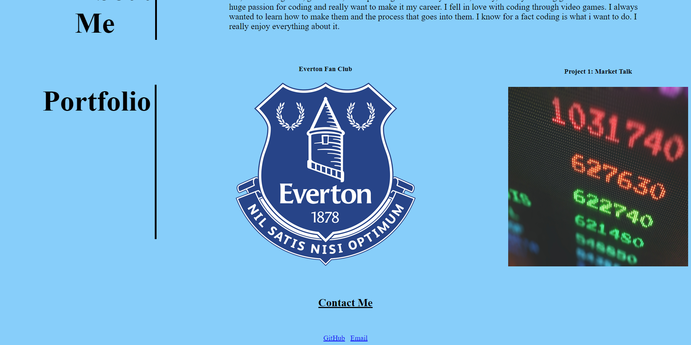

# Bretts-portfolio

Homework-2: Advanced CSS Professional Portfolio

 

## Description:

Created professional portfolio in html and css from scratch.

 

## Table of Contents:

- Installation
- Screenshots
- Credits
- Features:
- Criteria's met:
- URL

 

## Installation

Go to <a href="https://brobrett.github.io/Bretts-portfolio/">My Professional Portfolio</a> To view my Professional Portfolio Webpage.

 

## Screenshots

Screenshot 1

Screenshot 2

 

## Credits:

- I would like to thank my tutor and BCS for helping me out on some CSS details.

 

## Features:

- Functional nav bar
- Images open to webpage links
- Contact email will open to email
- Github link will send user to my github

## Criteria Met:

- Has my full name and recent photo
- Nav bar is functional and is linked to correct sections of webpage
- Has my first work on it
- When you click on images it sends you to the correct application
- Has contact portion that is functional

 

## URL (Github):

<a href="https://github.com/BroBrett/Bretts-portfolio" alt="My Github repo">My Professional Portfolio Repo</a>

 

## URL (Webpage):

<a href="https://brobrett.github.io/Bretts-portfolio/" alt="Professional Portfolio Webpage">My Professional Portfolio Webpage</a>

